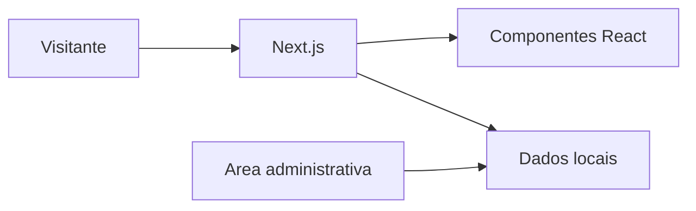

# Kalion Tecnologia

Site institucional e painel administrativo da Kalion Tecnologia, com estrutura em Next.js, React e TypeScript.

## Visao Geral

O projeto apresenta uma base web para divulgar servicos, organizar conteudo institucional e administrar informacoes por meio de componentes de painel. O repositorio possui estrutura moderna de aplicacao web, com dados locais e componentes reutilizaveis.

## Problema Resolvido

A aplicacao atende a necessidade de uma presenca digital profissional para a Kalion Tecnologia, reunindo apresentacao institucional, conteudo de servicos e area administrativa em um unico projeto.

## Principais Funcionalidades

### Funcionalidades Disponiveis

- Site institucional.
- Componentes React com TypeScript.
- Estrutura de painel administrativo.
- Dados locais para conteudo do site.
- Layout responsivo.
- Organizacao de paginas e componentes.

### Funcionalidades Em Desenvolvimento

- Funcionalidades administrativas aparecem em componentes e bibliotecas do projeto.

### Funcionalidades Planejadas

- Informacao nao confirmada no conteudo atual do repositorio.

## Como Funciona

```text
Visitante acessa o site
-> navega pelas paginas institucionais
-> conteudos sao carregados pela aplicacao Next.js
-> componentes exibem informacoes da Kalion Tecnologia
-> area administrativa organiza dados do projeto
```

## Tecnologias Utilizadas

- TypeScript
- React
- Next.js
- Tailwind CSS
- Node.js

## Arquitetura



## Estrutura Do Projeto

- `src/`: codigo da aplicacao, componentes e bibliotecas.
- `data/`: base local de conteudo.
- `public/`: arquivos publicos.
- Arquivos de configuracao do Next.js e TypeScript.

## Status

Projeto institucional em desenvolvimento/manutencao. O status de publicacao em producao nao esta confirmado no conteudo atual do repositorio.

## Autor

Desenvolvido por Michele Santana — Kalion Tecnologia

Perfil profissional: https://github.com/Tr3mbolon4
